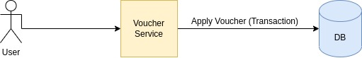

# Voucher App

The goal of this challenge is to create a Voucher Pool service in NestJs, which will facilitate the management of voucher codes for various customers and offers. The voucher codes can be used by customers to get discounts on the website. The entire system should expose a REST API and use TypeScript

### System Design Overview
The Main Flow about Apply Voucher Code Using Transaction over DB and make sure this Code begin Used once only

## Functionalities

1. Generate Voucher Code: For each customer, for a given Special Offer, and expiration date.
2. Validate Voucher Code Endpoint: Reachable via HTTP, which receives a Voucher Code and Email and validates the Voucher Code. If valid, returns the Percentage Discount and sets the date of usage.
3. Return Valid Voucher Codes: For a given Email, return all its valid Voucher Codes with the Name of the Special Offer.

## Transaction Benchmark
we Have benchmark Validate Voucher Api that sent 10k Request/10 Seconds Concurrent to Make sure only one user Can use this Voucher at same time Using Postman Runner To Simulate users Concurrent Requests  

## Rare Limiting
we have setup Ratelimit Functionality for our Specific end Points we have also it's Reusable and we're able to Add it to whatever end point we need
 

## Key Features

- Design a Database Schema: Plan the database structure.
- Write an Application: Code the core application logic.
- API Endpoint: For verifying and redeeming vouchers.
- Implement API Rate Limiting: To protect from abuse.
- Use Database Transactions: Ensure data consistency.
- Write Unit Tests: Ensure the code is tested and robust.
- Using TypeScript: Write the code in TypeScript.
- PLUS POINT: Writing Swagger for the API.
- PLUS POINT: Docker file to set up the application with all dependencies (database, Node.js).

## How to Run

1. Clone the Repository:
   
    git clone https://github.com/MahmoudAbuzeed/Voucher-Pool.git
    cd Voucher-Pool
   

2. Install Dependencies And Run Docker:
   
    docker compose up
   

3. Run Unit Tests (Optional):
   
    npm run test
   

## Documentation

Swagger API documentation is available at `localhost:3010/api`.

## Unit Tests

